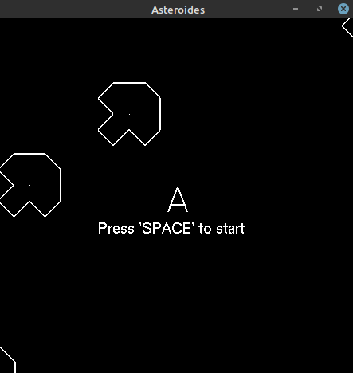
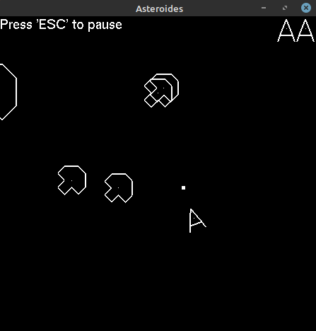

# asteroids
Uma cópia simplificada do famosos jogo Asteroids em C usando opengl.




## Dependências
Para o jogo funcionar corretamente, ele depende que um ambiente C/C++ esteja configurado em seu computador, além das dependências do opengl em C/C++.

Para configurar o opengl no linux, execute no terminal:
```
sudo apt update
sudo apt install freeglut3-dev libglew-dev libglfw3-dev
```

## Como executar

Execute os seguintes comandos:
```
git clone https://github.com/Daniel-Alencar/asteroids
```
```
cd asteroids
```
```
gcc Principal.cpp -o Principal -lGL -lGLU -lglut -lm
```
```
./Principal
```

## Como jogar

- 'Setas direcionais ou 'W,A,S,D' controlam a nave
- 'Espaço' faz a nave atirar
- 'ESC' pausa/despausa o jogo
